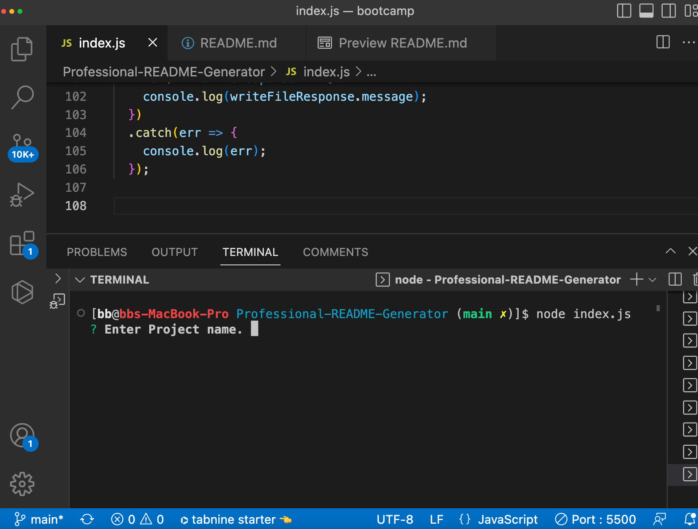
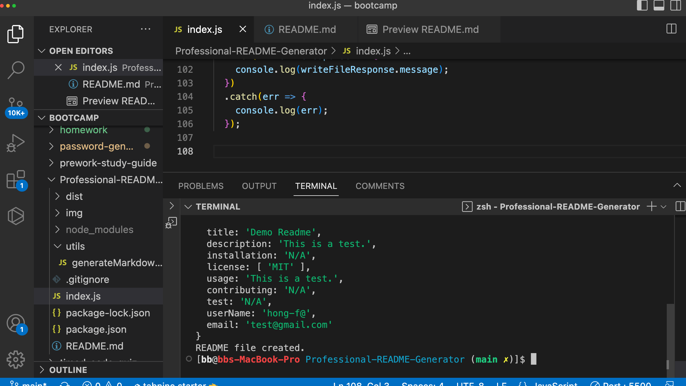
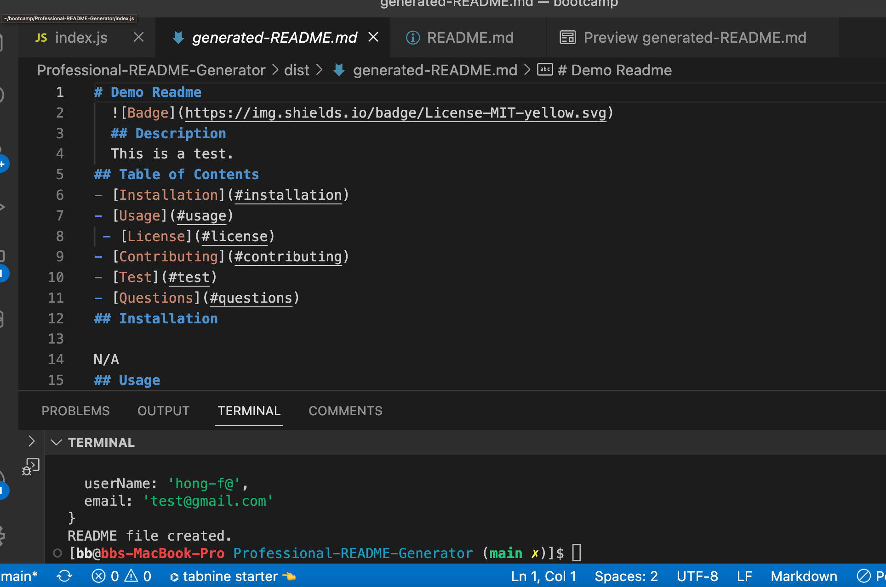

# Professional-README-Generator
## Table of contents
​
- [Overview](#overview)
  - [Description](#description)
  - [Screenshot](#screenshot)
  - [How To](#how-to)
  - [Links](#links) 
  - [Built with](#built-with)


​
​## Overview
​
### Description
​
This week's challenge was to build a professional Readme Generator by using a command line application to generate one. The goal is to create a command line application that dynamically generates a professional readme file a user's input using the inquirer package.
​

​
### Screenshot
​




### How To
1. In command-line, open index.js file.
2. Run the command
```bash
node index.js
```
3. Input answer to prompted questions.
4. Once finished, go to generated file to find the README file.
​
### Links
​
- GitHub URL: [https://github.com/hong-f/Professional-README-Generator]

​
### Built with
- JS
- Node.js
- inquirer